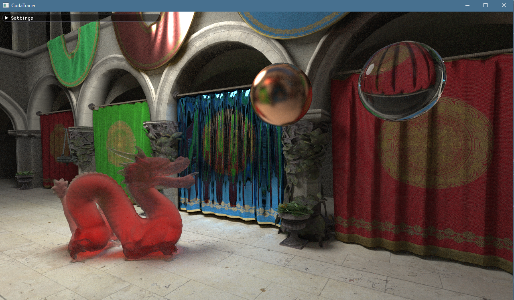
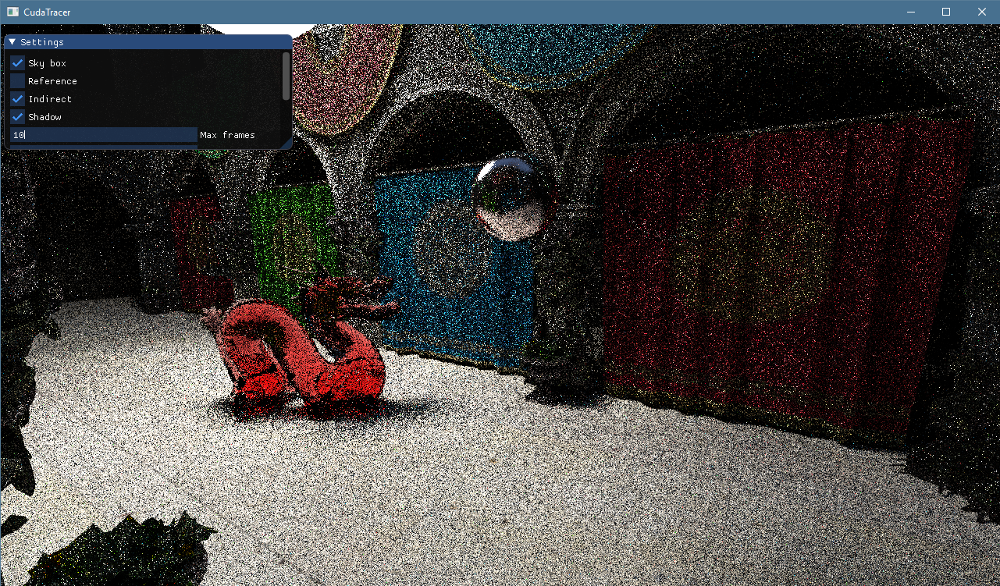
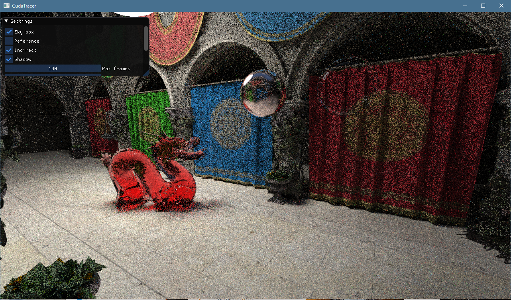
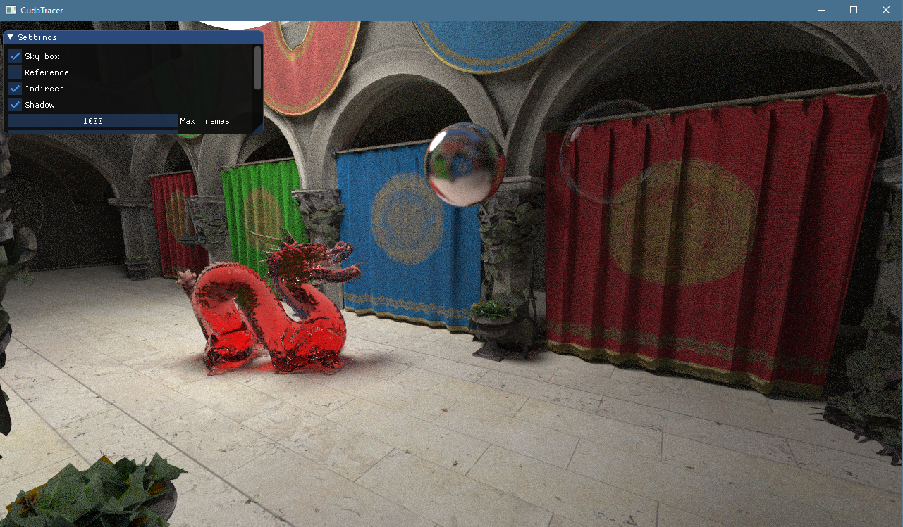

# CudaTracer

This project is based on my [OpenCL path tracer](https://github.com/MeirBon/tracer), but was rewritten to use CUDA and
be more performant.

Features:
- Binary BVH, Quad BVH
- Wavefront GPU path tracer
- Materials:
    - Lambertian
    - Specular
    - Transparent/Fresnel
    - Beckmann, GGX & Trowbridge microfacet models
- Multiple importance sampling of Lambertian and microfacet materials
- Real-time viewport
- Ability to change material properties in the viewport

# Screenshots

## 10 Frames

## 100 Frames

## 1000 Frames

## Dependencies
This project makes use of the following libraries:
- GLEW
- GLFW
- FreeImage
- CUDA
- Assimp